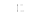

# Could have, would have, should have

## If correlation does not imply causality, what does?

### Introduction

There's a famous dictum among scientists that observing a correlation in your data does not mean that one thing caused another. For example, in a famous educational study, the best predictor of a student's success turned out to be owning books. Not reading them—owning them. It would seem that the best way to help our children succeed educationally is to stock books in our homes, but before we do that, we have to ask, "Couldn't it be that some other factor predicts both student success and home libraries?"

That's the conundrum in general: if A and B frequently appear in together in a dataset, does A cause B, does B cause A, or does some other C cause both A and B? The famous dictum about correlation not implying causality tells us to be suspicious, but it doesn't tell us how to determine if two things _are_ causally related.

Worse still, I'm a physicist. Physicists work in the basement of reality, studying the processes that underlie all the other sciences. Before we can even talk about student success, we have to define what it means for a student to succeed, who's a student, what's a human, how life is composed of chemicals, how forces give rise to chemical reactions, what forces are, and how we ever came up with these crazy notions of time and space in the first place. From a physicist's perspective, the other sciences take a lot for granted.

The thing that has troubled me throughout my career is that I couldn't see anything in nature (meaning "particles and thier fundamental interactions") that _looks_ like causality. If we say, "Books cause good grades," we want to mean, "If we give students more books, they will get better grades." We want causality to be knowledge we can act on. More fundamentally, a statement about a cause in physics might be, "If I collide these two protons, they will form a Higgs boson." But physically, there's only a correlation between proton collisions and Higgs bosons. That's why we have to collide so many protons—the probability of Higgs production is very weak.

And it's not just probabilistic—particle interactions can have atemporal influences. In the midst of a network of particle interactions that we draw as a Feynman diagram, it often happens that one particle will trace a closed loop in time, become an anti-particle when traveling backward in time, and annihilate with itself at an earlier time. These interactions are common enough that we have a name for them: penguins. (Richard Feynman once complained that "penguin" was absurd: these diagrams don't look anything like penguins. The speaker responded that they didn't look anything like Richard Feynman, either.)

These atemporal shenanigans have led many to say that quantum mechanics breaks causality. The way 19th century physicists thought nature worked, particles could only travel forward in time and each event happened because of events that happened at previous times, not future times. The discovery of quantum mechanics in the early 20th century revealed that those commonsense assumptions were too strong.

However, we're using the wrong word when we say that quantum mechanics broke causality. Quantum mechanics broke determinism. Consider a statement of causality like, "If I push this glass, then it will fall and smash on the floor." In a classical (19th century) view of physics, everything from the pushed glass to the toppling over and smashing on the floor is deterministic: particles in the glass are attracted to the center of the Earth, they accelerate according to prescribed laws of motion, and even the smashing is a complex but deterministic process. It would be possible to describe the trajectory of each shard of glass and how it spins as it flies through the air as a mathematical function. In fact, modern video games demonstrate this well: computers evaluate the formulae discovered by classical physicists, producing scenes that look just like real glasses falling off real tables.

The part that classical physics leaves out is the "If I push this glass" clause. Some physicists in the classical era were philosophical determinists: humans are made of atoms, which follow prescribed laws, so humans and their behaviors are prescribed as well. The human in this example couldn't _not_ push the glass. Other classical physicists thought there was a division in nature: human decision making is a divine spark, an input to nature's processes as much as a video game player is an exception to the simulation that governs everything else.

So even without quantum mechanics, there didn't seem to be any room for causality in nature. If we take one point of view, everything that happens is mathematically determined by past events, all the way back to the beginning or in an infinite chain without beginning (both are logically possible). The universe is a single equation, and equations are not causal: saying, "2 + _x_ = 7" does not _cause_ _x_ to be 5. It just _is_ 5. It hardly matters whether we run the formulas forward or backward—the whole is a single, self-consistent tapestry.

If we take the other point of view, however, we are gods. Human decisions are as important as universal gravitation in determining what happens to the glass. In a video game, this is explicit: there is a subroutine that listens for keyboard or touchscreen input and inserts motion or forces into the simulation ad hoc. If applied to reality, it begs the question of why humans are so special—where is that dividing line between the divine spark that thinks on its own and the particles that follow mathematical laws?

### Science fiction

Time-travel stories are laboratories for causality. We can only experiment on causality in fiction because (large-scale) time-travel is impossible in real life, as far as we know. Particles form closed time loops in penguin diagrams, but only in parts of the diagram that are fundamentally unobservable—if you reflect photons off of these particles to try to shed some light on the situation, the diagram becomes a different diagram, in which acausal influences become negligible or vanish. Science fiction takes the same scenarios and puts a human in the loop.

There are basically two kinds of time-travel stories: what I like to call "destructive paradoxes" and "constructive paradoxes." The destructive kind is more common. Marty McFly travels to the past and accidentally prevents his parents from getting together, which ultimately means that he won't be born and thus could not have traveled into the past to have prevented his parents from getting together. It establishes a real paradox—the thing could not have happened because it happened, and therefore, it must have happened.

These stories are usually a mess of contradictions. In _Back to the Future_, Marty McFly's siblings fade out of a photograph one by one and the danger is that Marty with fade away, too. There is no explanation why he would fade out _after_ the event, rather than before, or why his parents wouldn't get together without him preventing it. "Or maybe the destruction would be localized, limited to merely our galaxy!" These explanations don't make any sense, but I don't know how one _would_ explain an event that prevents itself.

The other kind of story, a constructive paradox, is rigorous about causality. The events that happen cause themselves—they happen because they happen—even if the characters who participate know about them in advance. These stories have a long tradition, including stories about prophesies like _Oedipus Rex_. Oedipus was told that he would seduce his mother (as Marty McFly almost did) and it was precisely the actions he took to try to prevent it that caused it to happen. The atemporal influence—a prophet who knows the future, in this case—fits like a jigsaw piece into the tapestry of events. This is not much different from closed time loops in penguin diagrams: the particle, now an anti-particle traveling backward to annihilate with itself, never misses.

This can be taken to a ridiculous extreme. Robert Heinlein's _All You Zombies_ is about a woman named Jane who is seduced by a man from the future, gets pregnant, and has medical complications while giving birth. In the confusion, the baby is stolen by another time-traveler and Jane is found to have been a hermaphrodite. As a result of the medical damage during birth, she is sexually reassigned as a man, joins a corps of time-travelers, and eventually traveles back in time to seduce him/herself. The baby, likewise, is sent even further in the past because she (secretly he) is our main character. In fact, there is only one character in the whole story: the mother, father, and child are all the same person, as well as the supporting cast—the inventor of the time machine and the commander of the corps.

In perfectly consistent stories like this one, we have to wonder why they happen at all. Jane didn't share any genes with the human race; there is no physical reason why she would look human. It is consistent that she invented time-travel—she had to, after all—but it would have been just as consistent if she had never existed and the whole story never took place.

Likewise, the process described by a quantum mechanical penguin diagram could entirely exist or entirely not exist. How well the diagram fits together (the degree to which wavefunctions overlap, allowing energy to flow between them like vibrations from a cello string to the cello's body) determines how probable the process is. That's what physicists are doing when they compute these diagrams: they multiply coupling strengths at each junction where particles could decay or combine, regardless of whether the influence comes from the future or the past, and if the product is a big number, the process is highly probable. This is an extremely precise science.

Nevertheless, it seems like much more of a problem when there are humans in the loop. Jane—who, like Oedipus and Marty McFly, also seduced her mother—could have refused. But if she had, she would never have been born. Her existence is exactly as mysterious as the existence of the entire universe: why does anything exist, rather than nothing?

Science fiction sometimes attempts to solve the problem, especially for destructive paradoxes. Changing something in the past is said to create an alternate timeline, a branch in history. If a normal timeline is a linear chain of dominoes, each knocking over the next, an alternate timeline is a fork in that line of dominoes. The junction event causes both of the parallel lines that follow. Usually, these histories are imagined to diverge socially and technologically from the splitting event. The alternate one always has zeppelins.

This view is made to seem less problematic than it is because the science fiction story usually follows the time-travelers who "cause" the timeline to split. Following their subjective time through the story, history was not split "before" they intervened and it was split "after." If the alternate timeline is "wrong" (e.g. fascist), then we as audience follow the time-travelers as they go back and "prevent" themselves from splitting history in the first place. In the end, time had never split. All is good.

The problem is that we're only considering the time-traveler's subjective history as being real. We have value judgements about timelines: one is natural, the other is alternate. Which timeline exists is something evaluated from the traveler's point of view: it wasn't split, then it was, then it wasn't again. This kind of lazy storytelling uses time as a setting, somehow distinct from the stream of events in which the story plays itself out.

If we take the time-split seriously, what happens when the time-traveler accidentally creates a fascist dystopia? The traveler is just _visiting_ a fascist dystopia that already existed. When the traveler goes back to the turning point and follows it forward along the original timeline, we all return home to our preferred setting, but the fascist dystopia still exists. If it could be said to exist while we were visiting it, it still exists now. How, then, is it a victory when the original timeline is restored?

At their laziest, science fiction authors invoke Hugh Everett's many worlds interpretation to explain the split timelines. Hugh Everett intended to explain the multi-valued nature of quantum properties (more on that later) by suggesting that every point in time is a split timeline. A particle that a quantum mechanic would call "50% here, 50% there" is, in Everett's view, "here" in one universe and "there" in another; it's a low-level communication between diverging timelines that lets a particle appear to be in both places.

Although that's a possible explanation of quantum entanglement, it should be considered a disaster for storytelling. Not only is our timeline as real as the fascist dystopia, but so is every tiny variation in between. There's a universe in which an electron in my shoulder jiggles left and a universe in which it jiggles right, and a whole history of everything propagates from each possibility after the entanglement washes out and the timelines diverge. History would be dense with forked timelines. Not only can we pick and choose our favorite timeline, but we have a continuum to choose from.

Thus, if our hero escapes against 100-to-1 odds in one timeline, he didn't escape in the other 99. He didn't beat the odds. Storytelling becomes an exercise in selective reporting, which is utterly uncompelling.

### The problem quantum mechanics poses

Physicists tend to romanticize the pre-quantum era as a time of innocence. In the good old days, nature was deterministic. Knowing the past and the laws of motion, we can derive the future. It all made sense.

The first upset was relativity: intuitively, we'd like to think of time as an offstage drumbeat that continues independently of what happens in the play, but Albert Einstein presented a vision of time as a dimension similar to space. Just as rotating a picture frame mixes one dimension of space—height—with another—width—traveling at some speed mixes a dimension of space with time.

The analogy isn't perfect: space-space rotations are cyclic. You can rotate a picture frame through 180°, which completely reverses the direction of height. Space-time rotates using hyperbolic sine and cosine functions, rather than trigonometric sine and cosine functions, which maxes out at 45°, where one unit of distance is covered in an equal unit of time. (Since time is a dimension, it can be measured in units of distance, such as light-years.) This asymptotic limit is called the speed of light because light is one of the things that travels at this speed.

That was an upset, at first, because it introduces a no-man's land between past and future. Since the fastest trajectory any moving particle or propagating wave can take has an upper limit—there are events happening now that we can't be aware of. A nearby star could be exploding at this instant, but it will take years for the light, gravitational waves, neutrinos, or anything else to reach us. More disturbingly, "now" is ambiguous. A star exploding today that we won't see for 10 years has, in another frame of reference, already exploded 9 years ago. In yet another frame of reference, it won't actually explode for another 9 years. These reference frames are the time that would be experienced by astronauts in fast spaceships: their subjective time is slower or faster, stretched by hyperbolic sine and cosine functions, in a way that is completely self-consistent. All physical events involving contact at the same point of time and space are unchanged.

These reference frames are just as valid as our own reference frame, stationary on Earth, and surprisingly enough, no real paradoxes arise from this situation. Our intuitive notion that the definition of "now" should be independent of speed is wrong, but if we weaken our description of nature to only those things we can physically measure, contact interactions of two particles at the same point in space and time, then everything is consistent.

So in physicists' romanticized history, relativity is a part of classical mechanics. But then came quantum mechanics.

At small scales, particles don't appear to have single-valued properties. Particle position can have multiple values—here _and_ there—speeds can have multiple values, as can rotation rates and a lot of new properties that describe nuclear and subnuclear interactions. The one I find most striking is rotation rate, called "spin," which is always quantized in exact units. Imagine a record player that can only play at 33, 45, and 78 RPM, never anything in between. A quantum record player could play at 45 _and_ 78 RPM, but it could never play at 60 RPM, not even as part of a transition from 45 to 78 RPM. That's just the way it works. Spin is not a dimmer switch that slides through a continuum of values, it's an on-off switch that might be 30% on, 70% off.

These intermediate states can't be directly observed, however. If you ask a quantum record player in the half-45 RPM, half-78 RPM state how fast it's spinning (by bouncing a photon off of it: i.e. _looking_ at it), it will respond "45 RPM" or "78 RPM" with equal probability. Henceforth, it will be in an all-45 RPM or an all-78 RPM state, as though it had never been in a mixed state. Moreover, anything that depended on which state it was in would also act as though the record player had always been in the new state. Multi-valued states, by themselves, are not a problem—we could have expanded our mathematical model of nature to include functions on sets of numbers, rather than functions on numbers. It's the "pretending to have always been 78 RPM" that's a problem. The record player has retconned its own history.

Since these mixture states can never be observed, it's fair to ask why we should believe in them at all. For a while, physicists tried to find a way out. From 1928, when Niels Bohr identified Max Born's statistical interpretation as a quantum postulate, to 1964, when John Bell described a make-or-break measurement to decide the issue, or perhaps 1981, when Alain Aspect, Philippe Grangier, and Gérard Roger actually performed that measurement for the first time, it was possible that mixture states were a theoretical contrivance, hiding what was actually just noise in the system. For decades, physicists tried to prove that a record player observed to be spinning at 78 RPM was actually spinning at 78 RPM before it was measured or was forced into that state by particle collisions.

Bell's Inequality, which Alain Aspect and many others have since measured, quantifies a distinction between correlations that quantum mechanics predicts and correlations that _any_ classical alternative could possibly predict. There are many variations on the argument, but they all go like this: let's say that you have a quantum record player that is in a half-45 RPM, half-78 RPM state and a quantum tape recorder that records the music it plays. At 45 RPM, the music would sound normal; at 78 RPM, it would sound like squeaky chipmunks. The tape recorder records the record player and then the two are moved far apart. Alice observes the record player and Bob observes the tape recorder. With 50% probability, Alice finds that the player is at 45 RPM and Bob hears normal music, and with 50% probability, Alice finds that the player is at 78 RPM and Bob hears squeaky chipmunks. When Alice and Bob get together to compare results, they find that they are consistent.

If this experiment is performed many times, Alice and Bob accumulate a dataset that shows a strong correlation between the record player setting and the sound of the music on the tape recorder. If there were no mixed states—if the record player fluctuated between 45 and 78 RPM because of noise in the measurements—then the correlation wouldn't be as strong. Physicists proposed sneakier and sneakier theories in which the mixed states are just an illusion, to try to claim that quantum processes do not rewrite their histories and yet can achieve these high correlations anyway.

That's what John Bell was doing: he was trying to formulate alternatives to standard quantum mechanics. Thwarted at every turn, he weakened his assumptions to determine the maximum correlation that would be possible for _any_ theory without mixed states. In certain circumstances, the maximum possible correlation for a "realist" theory is less than what standard quantum mechanics predicts. Alain Aspect et al performed the measurement and standard quantum mechanics was vindicated.

The problem will not go away.

### Solutions to the problem quantum mechanics poses

One of the weak assumptions that John Bell made was that information does not propagate faster than the speed of light. Alice's record player and Bob's tape recorder were separated before they performed their measurements so that the record player, if it was measured first, would not send a secret message to the tape player to pretend it had always been squeaky chipmunks. Likewise, Bob's tape recorder couldn't send a secret message to the record player to pretend it had always been set to play at 78 RPM. Since they are far apart, relativity allows Alice's measurement to be before Bob's _and_ Bob's measurement to be before Alice's, so if there is a secret message, one is necessarily from the future in _some_ valid frame of reference. Real experiments of this effect have to perform their measurements quickly enough and far enough apart to be in this no-man's land of neither past nor future. The two parts of the entangled state have to speak for themselves, without help.

Thus, one easy way to solve the dilemma is to suppose that information can travel faster than light. This is an act of despiration—the "secret messages" were already act of desperation—not only are we failing to explain why the two parts of the entangled state want to engage in this subterfuge, but we have to break a well-measured physical law to allow it.

Hugh Everett's many worlds interpretation is another solution. Instead of imagining one timeline that particles can rewrite or affect their former selves like Jane the time-traveler, we imagine an ever-splitting timeline with single-valued properties in each. When Alice observes the record player at 78 RPM and Bob hears squeaky chipmunks, there's another universe in which Alice observes 45 RPM and Bob hears normal music. They're correlated because they're in the same universe as each other. As Alice and Bob perform the experiment over and over, doubling the number of universes with each experiment, they always happen to find themselves in the same universe as each other, and hence with consistent histories.

This works—it explains the paradox—but we lose our will to live. For every good deed I might do, there's a version of me that does the opposite. Every single thing that could happen is happening, all the time. Not only is there no reason to live, but I am in fact dying all the time, continuously. I mean we lose our will to live in the most literal sense: we lose our will. We can't make a thing happen because to say that it happens is just as correct as to say that it doesn't happen. Whether you feel motivated or dispirited by that is beside the point.

There's another, less-often discussed alternative. Unlike the many worlds interpretation, I think it's safe to say that this one has no adherents. One detail of Bell's Inequality that I have left out until now is that the problem isn't just correlation, it's correlation between independently made choices. If we simply separated the record player and the tape recording, a non-quantum theory could posit that they both carry the stamp of the decision they're both going to make: 78 RPM and squeaky or 45 RPM and normal. Bell's Inequality is a correlation between entangled states in response to independent decisions made by widely separated experimenters.

An electron's spin, like the quantum record player, is quantized: it can either be spinning clockwise at a certain rate or counterclockwise at that same rate. But "clockwise" and "counterclockwise" presupposes an axis. If an electron is spinning clockwise as seen from below, measurements of its spin relative to that vertical axis will always result in "spin up." Likewise, counterclockwise as seen from below is "spin down." But if you measure the same electron's spin along a _horizontal_ axis it would be 50% "spin left" and 50% "spin right." If you measure along a diagonal, it's a different percentage, such that an axis that's very close to vertical would be 99% "spin uppish" and 1% "spin downish." This is a fact about quantum mechanical spin: a pure state measured along one axis is a completely mixed state along a perpendicular axis and a correlated state when measured along any other axis.

Bell's Inequality actually concerns these in-between correlations—Alice measures relative to a vertical axis and Bob measures along some diagonal. If Alice and Bob agree ahead of time what angles they will choose, the electrons might overhear them and pick spin values along these axes that correlate appropriately. Thus, Alice and Bob must choose their axes of measurement on the fly, after they're already separated by a great distance, and they must make their choices rapidly enough that secret messages can't be passed between the particles. The crux of the argument is that Alice and Bob are free to choose what experiments they perform.

Here's the alternative interpretation that exploits this loophole: superdeterminism. In a superdeterministic universe, everything is predetermined, including the choices that Alice and Bob make, and it forces their hand in such a way that the experimenters themselves _happen to choose_ combinations that look like standard quantum mechanics.

This is not 19th century determinism, in which all motions follow from a simple mathematical law. Superdeterminism forces complex structures, such as human beings, to participate in a pageantry that would otherwise resemble a simple non-deterministic law. It's not the determinism of a clock or a wave, it's the determinism of a video played on a computer, in which the colors of each pixel in each frame are fixed from the beginning. It is a movie created by a trickster god in order to trick the entities on the frames of this movie, who don't have any capacity for independent thought anyway.

Both of these extremes, many worlds and superdeterminism, are attempts to save determinism from atemporal influences: Jane the time-traveling particle. I can't object to them on physical grounds because they are interpretations that explain the same phenomena as standard quantum mechanics, but philosophically, they are wrong. They're wrong because they are pointless: these theories describe a world of automatons who cannot appreciate these theories. At best, they are theories that a solipsist (someone who thinks he is the only consciousness in the universe) might think about everybody else.

The reason it's useful to consider the many worlds theory and superdeterminism is because they show exactly what is missing when you try to define causality in a deterministic worldview. Causality, the idea behind "If I push this glass, then it will fall and smash on the floor," needs two things: (1) a distinction between the real world and possible worlds, and (2) the idea that experimenters can make choices.

There is no causality in the many worlds theory because the glass falls and it also does not fall, each in different universes. There is a one-to-one relationship between the pushing and the smashing (mostly: there are small quantum probabilities for just about everything). But this is a correlation, not a cause. Causes are actionable: if putting books in a child's home really does increase their chances of success, then let's get some books! But if both branches of the if-then are _always_ taken, then that's not what we mean by causality.

Much more so for superdeterminism: this theory denies that any choices are possible to the extent that conclusions cannot be drawn from experimental measurements. In fact, it was invented to escape the interpretation of a particular experimental measurement. It's irrational to say, "I don't believe in free will because of science," because conclusions (such as this one) can only be drawn from measurements if the experimenters were free to choose which measurements to perform. If the experimenter's hand is forced to selectively take data only when a positive result would be obtained, that's the very definition of biased data.

Quantum mechanics didn't introduce these problems—they were present in 19th century determinism because they are problems with determinism. However, they are brought to the fore by attempts to save determinism from quantum mechanics.

Ironically, quantum mechanics didn't break causality; it might have just saved it.

## Thoughts and Stuff

### Two different kinds of reality

Western philosophy is obsessed with the distinction between ideals—objects of thought—and empirical objects of the natural world. Statements about ideals can be proven without making any observations (_a priori_): a mind can discover them in isolation. Statements about the natural world require observations (_a postiori_). As a kind of shorthand, I think of them as "math" and "science," though ideals are more general than math and the physical world is more general than science. Instead, perhaps we could call them Thoughts and Stuff.

This distinction is an important one to make. In fact, it's important just to recognize these categories and that each one has a method for discovering its own kind of truth. For the world of Thoughts, the method is logical proof. Before classical Greece, the Egyptians had geometry and fractions, Babylonians had a square root formula and the Pythagorean theorem, and many cultures had weights and measures, but the Greeks, particularly Aristotle and Euclid, developed mathematical proofs into the rigorous method we use today.

The important thing that they recognized was that logical statements are connectives from axioms or postulates, which have to be assumed, to theorems, which are derived. The truth of a logical statement has the form "if this, then that." Even a basic statement like 2 + 3 = 5 depends on definitions of 2, 3, 5, plus, and equality, and it remains true if the definitions of natural numbers are replaced by something equivalent, such as Peano arithmetic, in which numbers are sets of sets.

These statements and their proofs really are independent of empirical observation—experimental measurements are irrelevant—and they're independent of culture as well. A statement like 2 + 3 = 5 might be motivated by seeing a group of 2 rocks and a group of 3 rocks, but the statement itself is a more basic fact than the rocks, as it applies to anything that can be counted. Although different cultures focus on different areas of math, they arrive at the same universal truths when they study the same problems. Separated by the continent of Asia, Archimedes and Liu Hui both calculated π and arrived at the same value within 0.1%. The idea of π is not a Greek idea or a Chinese idea.

Today, computers provide an even stronger illustration of the objectivity of logical thinking: it can be automated. Logical statements can be reduced to symbol-sentences in a specified grammar and deduction can be reduced to substitution rules on those symbol-sentences. Checking proofs is easy to automate; searching for proofs is harder because the set of possible substitutions is large if unguided, but it's possible. For instance, the Four Color Theorem, which had resisted proof for centuries, was finally solved by checking an exhaustive set of special cases by computer. Mathematicians sometimes deride such proofs as "symbol pushing" for reasons that I'll discuss below, but the fact that logical thinking can be mechanized demonstrates that we are _discovering_ something when we formulate a proof. We're not making something up and agreeing to uphold it as dogma.

Despite the power of proof for pure logic, it is insufficient for statements concerning the world of Stuff. Aristotle's syllogisms were spot on but his physics was not. For instance, he argued that the Earth was motionless with the stars and planets rotating around it because (a) things fly off spinning objects, (b) if the Earth moved, it would leave flying birds behind, and (c) the relative angles between stars would change over the course of a year ("parallax"). All of these are common-sense postulates, but careful observation would show that they are all wrong: (a) the Earth doesn't spin _enough_ for objects to fly off of it, just some mild oblateness at the equator, (b) velocities of relative motions are additive, not absolute, and (c) the parallax effect is real but small because stars are very, very far away. The logic was perfectly sound; the facts were not.

Much like the development of logical proof in classical Greece, a scientific method developed in the Italian renaissance to put statements about the natural world on a firm footing. The central idea of this new scientific method was the use of experiments as interventions in nature. The classical and medieval method of discovering facts about the natural world was to passively observe it; scientists like Galileo actively modified an isolated environment to make general statements about the world.

For example, Galileo's claim that objects fall with identical acceleration, regardless of their weight, derived from experiments with polished balls sliding down planes. (Not a demonstration at the tower of Pisa; that was described as a thought experiment.) His opponents were understandably skeptical: Galileo explained that the experiments would only give correct results if the balls sliding down the planes were polished thoroughly to remove the effect of friction, but how could such a specialized environment apply to the whole universe? And yet it's exactly what you need to do to isolate one effect from another in the complex natural world. Friction, in particular, confounded medieval physics: the many theories of motion (additive, multiplicative, and even logarithmic) grappled with the fact that moving objects slow down on their own. Removing friction made the basic laws of motion plain; friction could be reintroduced later as a complication to study on its own, rather than an essential feature.

The scientific method is still evolving, just as logical proof is evolving with the introduction of computers. Precise measurements were recognized as important early on: Aristotle was wrong about objects flying off the Earth and the parallax of stars only in a matter of degree. Mathematical models were introduced in physics in the 18th and 19th centuries, and the use of statistical inference has only become common in the 20th century. Sciences involving humans are now protected from bias by double-blind procedures, and blinding is becoming common in particle physics as well. Parts of the scientific method accumulate as their necessity gets recognized.

My main point, however, is that statements about logic are fundamentally different from statements about the natural world. The method for discovering logical truths doesn't work when applied to physical truths and vice-versa.

This distinction has been called Hume's fork and it has occupied a lot of Western philosophy. The point where I think the contrast between ideals and reals breaks down is when a philosophical system claims that objects of pure thought are real and the physical world is but a shadow, or the reverse: that there is naught but atoms and the void. Team Thought has had its adherents, such as Plato and Bishop Berkeley, and Team Stuff has had its own, such as Democritus and Hobbes.

The problem, I think, is that it's hard to fit these wildly different things into the same word, "real." If you're in a mode where you're thinking of mathematical objects as real because they're untarnished by mismeasurement and inductive reasoning, then the physical world is not real in the same sense. But if you're thinking of physical objects as real because they are external to our minds, then the world of logic is not real in the same sense.

"Real" is just a word; we attach words to clusters of similar things, and it's a stretch to attach the same word to these two clusters, so how about two words? I like "valid" for logical truth and "factual" for physical truth. Saying that a logical statement is valid emphasizes that it's a connection from its premises to its conclusions, and saying that a physical statement is factual emphasizes that it's external to our minds.

So we've living in two realities at once: a world of Thoughts and a world of Stuff. Taking this further, I would say that there's yet another.

### A third reality: narrative

Pure logic and pure empiricism are not what mathematicians or scientists do. A paper listing billions of addition statements as theorems would be logically verifiable (by computer) and even novel (these _particular_ statements have never been uttered before), but not interesting. A table of measurements of thermal fluctuations in a rock would be factual, but not interesting. Both of these examples miss the point of why mathematicians and scientists do what they do.

The purpose of math and science is to explain things. An explanation is a story—a narrative—that steps from motivation to revelation in an emotionally satisfactory way. Just as a fictional story is not just "stuff that happens" (I'm deliberately excluding "slice of life" stories), a mathematical or scientific narrative has to come to a pleasing conclusion. Richard Feynman was fond of calling it the "pleasure of finding things out," because it is an emotional response. This is too often downplayed.

To illustrate the significance of narrative, consider Johannes Kepler's attempt to explain why the six planets have the exact orbital distances that they do. At the time (1597), only six planets were known to exist (Mercury, Venus, Earth, Mars, Jupiter, and Saturn)—Galileo's telescope hadn't yet revealed that there are smaller objects waiting to be discovered (1609). There are five spaces between the orbits of these six planets, and the number five suggests the five platonic solids (pyramid, cube, octahedron, dodecahedron, and icosahedron). The planetary orbits _almost_ circumscribe the platonic solids, one inside the other. Kepler thought he had it nailed: the solar system has the relative sizes and number of planets that it does because of a very fundamental fact of geometry. Unfortunately, he was thwarted by good empirical measurements and his own honesty—the orbits didn't fit perfectly, and this kind of explanation doesn't allow for imprecision.

Today, we know about Uranus and Neptune, as well as countless objects from the size of Pluto and Ceres down to grains of dust. There's no fact of "six planets" to explain. As for their orbits, we know that they changed in the early solar system (Jupiter was moving inward before Saturn formed and pulled it back) and that the whole thing came from a chaotic swirl of dust. The distributions of orbits are interesting, not just in our solar system, but in solar systems in general, as well as statistical features of the dynamics, but an exact play-by-play of which rock hit which other rock to give us the current solar system that we have would not be interesting. If somebody managed to work it out, the paper would be called a "tour de force," but would not be read.

A similar shift in narrative may be happening right now in particle physics. String theory has not produced a satisfying theory of everything, in that it has not explained why the known particles exist with their masses and interaction strengths from a unified principle of vibrating strings (or more generally, branes). The problem is actually an embarrassment of riches: the fundamental theory predicts an enormous set of energy wells that the universe could have settled into, each one with a different set of particles, masses, and interaction strengths. The real universe—at least the part of it that we can see with telescopes—would have settled into one of them through a random fluctuation in the Big Bang. Since that fluctuation was random, string theory has nothing to say about why this set of particles and not another (and this one is statistically unusual).

Thus, it seems like string theory is out of the game of predicting why we have the particles that we do, in much the same way that it isn't sensible to ask why our solar system has the exact number of planets and orbital distances that it does. For some physicists, this means that string theory fails as an explanation and should be discarded; others have changed the narrative. They say, perhaps the universe does randomly choose an energy well—different parts of the infinite universe choosing different wells—and we find ourselves in the one we're in because it has the right particle content to support life. Most energy wells wouldn't allow molecules or solid matter to form. The answer to why we're in this highly unusual pocket of the universe is that we're here to ask the question.

This new narrative is highly controversial. It's called the "anthropic principle" and most physicists don't ascribe to it. To accept it would be to give up hope of a complete explanation, some fundamental principle that explains why we have the particles we see—and only those—as a necessary derivation. But like Kepler's six planets, maybe there isn't something to explain.

Like statements of validity and statements of empirical fact, narratives can be true or false. Ptolemaic models of the solar system with circular orbits and epicycles upon epicycles could fit all of today's experimental measurements by adding yet more epicycles, but elliptical orbits are more true, and general relativity is even more true. The method of determining the truth of a scientific narrative is as different from the scientific method as the scientific method is from mathematical proof. When an explanation is free from logical flaws and agrees with all measurements, the arguments for it involve words like "simplicity," "beauty," or at least "concordance."

Narratives are not as objective as the scientific method or mathematical proof. It's not as clear that narratives are as free from bias, fashion, or cultural dependence as statements of validity or empirical fact. But there was a time when people studied the natural world without a scientific method, and a time when people studied math without formal proof. Narratives might not have had their scientific revolution yet.

### Models

Like scientific explanations, narratives in fiction come to some sort of conclusion, though it can be hard to say what that conclusion is sometimes. Stories produce a feeling of conclusiveness that is similar to the feeling of conclusiveness in a scientific explanation, but the subject matter is different: fiction doesn't involve empirical facts.

In general, there's a spectrum:

   * At one end are scientific models, to be described below.
   * Close in magnitude are stories that are fictitious explanations, such as creation myths and just-so stories like _How the Leopard Got His Spots_. If they are believed to be true, then they are essentially science, maybe incorrect and maybe lacking in methodology, but attempting to do what science does. If these stories are told with the understanding that they are not true, yet have some other kind of value (e.g. Rudyard Kipling's intention in his just-so stories), then they're further along in the spectrum.
   * Next are fables with a stated moral, such as Æsop's Fables or _With Great Power Comes Great Responsibility_ (alternate title: _Spiderman 1_).
   * Beyond that are stories that obviously address a question, such as "Can men and women be friends?" in _When Harry Met Sally_. Bad examples of this might answer such a question with a simple "yes" or "no," which makes you wonder why the author went to the trouble of writing a story instead of an essay.
   * After that, the topic is a nuanced theme, such as _Crime and Punishment_. A theme isn't a clearly phrased question, so the conclusions about it can float more nebulously around the central idea, answering different questions and possibly contradicting each other.
   * Some stories are more like ruminations. The theme is not even an abstract idea like crime or punishment—it's a mental setting, like "coming of age." A plot summary of _Kiki's Delivery Service_ would sound like a series of unconnected events, but the way it was presented, they were strongly, but obliquely, connected.
   * At the other end of the spectrum, some stories are intentionally full of disconnected non-sequitors. A play like _Waiting for Godot_ is often given as an example of modern detachment from meaning, like John Cage's musical composition _4:33_ (which is silent for that length of time). Despite the random dialogue, however, the play's randomness _is_ its point. So it's not really devoid of meaning: it's making a statement about lack of meaning. When everything repeats itself in the second act, indicating that it will go on and on meaninglessly, the repeated dialog is truncated—only enough is given to communicate to the audience that there is a cycle, and then the play itself stops and everyone goes home.

Slice of life plots, generated without any point at all, are either at the very end of the spectrum or a little beyond the end, depending on how broadly you want to define a "story." I consider them non-stories, much as sounds that disregard harmonic intervals are non-music, though it's still interesting to hear and talk about them as examples outside the definition, to illustrate what the definition means.

What everything in this narrative spectrum has in common is the sense that things that did not fit together at the beginning fit together at the end. Scientific explanations have this in common with fiction—I think it might be the very same emotions, though we'd have to ask a neuroscientist to find out whether the same parts of the brain are involved. Scientific explanations differ in that the pieces that they fit together are empirical facts—data collected in experiments—while stories fit together fictitious events and characters.

One form of fiction, which might be relatively new, works with fictitious facts (not events or characters), fitting them together in much the same way that a scientific study fits together real facts. These include fan theories of _Star Wars_ or _The Lord of the Rings_. I personally worked out a theory of warp drive from the inconsistent things that were said about it in _Star Trek_ technical manuals: this sort of thing is becoming common. On the spectrum, explanations of fictional universes may be said to occupy the same place as scientific explanations—the spectrum measures specificity, not truth.

Scientific explanations are distinguished by being as specific as possible. In the first few centuries, scientists wrote purely in natural languages, using the most precise phrases available in those languages. Gradually, the symbol-sentences of mathematics were mixed in, though there's still more text than formulae. Now even computer programs can be said to encapsulate a scientific explanation—a means of expression that can be demonstrated by executing it. Thus, explanations are a bridge that spans the two very different kinds of truth: empirical facts and validity.

An explanation that is explicit about its mathematical form is called a model. Models are postulates in the language of validity, but what they describe or predict points back to what experiments would measure in fact. We can make valid statements about a model that we know is inconsistent with the facts, but there isn't much we can do with a model that is internally inconsistent.

Models are increasingly being distinguished from the reality they're supposed to represent. In this, particle physics might be behind the times. Although we summarize our current understanding of particles and their interactions in an explanation called the Standard Model, we still expect some improvement upon the Standard Model to be _the_ model of everything, the Weltformel that "really is" what drives the universe. I worked for a few years in data science, and found their cavalier attitude toward models shocking: data scientists invent models to fit data for a specific purpose, such as predicting the value of a stock; they're not intended to explain what's really going on and aren't even expected to predict quantities beyond those of interest.

This seems to be happening in most of the sciences, as far as I can tell: models are proposed as forever-provisional substitutes for the ultimate truth, all designed for specific purposes. After returning to physics, I noticed that we do this too—theories that are too complex to mathematically evaluate (e.g. quantum chromodynamics) are replaced by effective models, known to be untrue at their core, to perform calculations in regimes for which they are good approximations.

Just as the scientific method is a set of best practices for discovering empirical facts and formal proof is a method for determining truth in logic, model-building may be an emerging method that makes explanations objective. There are even ways to express the simplicity of a model other than words like "beauty," such as the Akaike Information Criterion (AIC), which counts the number of free parameters in the model. When modeling planetary orbits in the solar system, hundreds of epicycles might make a good fit, but elliptical orbits use far fewer parameters.

But there's more to a good model than minimizing its number of parameters. Traditionally, we'd say that a better model is "closer to the truth," but perhaps this could be expressed as the ability to use a model to find the next (more deeply satisfying or more widely applicable) model. Elliptical orbits are better than epicycles because the reason for an ellipse can be explained by the next model, Newton's law of gravitation, which derives orbits as conic sections (circle, ellipse, parabola, and hyperbola). Although the Newtonian model doesn't explain very fast, very massive, or very small phenomena, it is an excellent model and can even be considered correct in its domain. It is a better model than, say, Descartes's vortex model of the solar system, not just in the accuracy of its predictions, but in the fact that it provided a springboard to the next models: relativity and quantum mechanics.

Speaking in terms of models makes us conscious of the fact that we don't have direct knowledge of physical reality. There have always been philosophical weak points in the scientific method, such as the inductive principle: "If the sun rises every morning for thousands of years, does that mean that it will rise tomorrow?" Logically, no, it doesn't, but this is the kind of objection that we need to swallow to do science: we take a lot of measurements of a statistically fluctuating quantity and assume that we have a representative distribution of the quantity when we're not measuring it. Every discovery these days is expressed in terms of the statistical probability that it might be a fluctuation: readers can decide if they're willing to interpret five sigma as a million-to-one fluke.

In terms of models, I would answer the question about the sun rising tomorrow as, "I believe the sun will rise because of what I know about the Earth's rotation." It is the _model_, not the dataset of sunrises, that is the basis of my belief. The model, in turn, is supported by thousands of other cross-cutting observations, such as Foucault's pendulum and satellite photos of the Earth as it spins in space. All of the empirical measurements that support models and the models that determine the interpretation of measurements form an interconnected web. I'm highly confident of the parts that fit together and less confident of the parts that don't.

Nevertheless, there is a circularity that would not be allowed in pure logic: we can't make a direct empirical measurement that is not interpreted in terms of a prevailing model. We might say that a measured magnetic field is 5 Tesla, but that depends on an understanding of how our magnet-measuring device works. We might say that the electric current through that device is 7 Amps, or even that the head of a needle is close to the inkblot that looks like the number "5," but even the latter is based on the interpretation that the needle is a coherent object that is free to move and the position of its head is relevant for measuring magnetic field.

All of our measurements are model-dependent, and all of our models are supported by measurements. The fact that models do not claim to be truth helps to be explicit about this circularity, so that it can be unwound when a model fails.

### Causality is in the model, not the data

All of this comes back to causality. If you remember from the introduction, I couldn't find anything like the causality of "If I push this glass, then it will fall and smash on the floor" in physics, regardless of whether the physical world is thought to be deterministic classical mechanics or random quantum mechanics. In a fully deterministic world, the glass-smashing and my hand-pushing are part of the same equation, the one doesn't cause the other any more than "2 + _x_ = 7" causes _x_ to be 5. Simply inflating these equations with randomness, smearing out the probabilities from 0% and 100% to values in between, doesn't help by itself.

To make the "if-then" part of the statement meaningful, we need conditional verb tenses: not just IS, but COULD BE. Like a statement of validity, this glass-pushing statement is a connective: it doesn't say that I do push the glass or that I don't, it's just saying what WOULD happen if I did. But unlike a statement of validity, it concerns the natural world. The glass-pushing statement is about gravity, something we wouldn't know about if we had no experience of the physical world.

The "if-then" is not an empirical fact, either. To say, "I did push the glass and it did fall on the floor" would be an empirical fact, describing something that IS. But this relationship between pushing the glass and its consequences is stated in the abstract, not as a thing that happened.

Causality statements are explanations, not logical or empirical statements. Like the narratives I described above, they connect the empirical world with logical deduction using a model: a mathematical description of tables, glasses, hands, and gravity that we can play forward or backward in our minds as a mathematical object. We could even model it on a computer, a video game simulating the physics that is controlled by a keyboard (W-A-S-D), and very concretely check the correctness of the statement by running the simulation with and without pushing the glass. But like a mathematical theorem, the correctness of the statement depends on the model as a postulate.

Theories of causality as relationships between possible worlds, rather than facts in the real world, are surprisingly recent. According to the [Stanford Encyclopedia of Philosophy](https://plato.stanford.edu/entries/causation-counterfactual/), the earliest such theory is David Lewis's 1973 analysis, barring an offhand statement by David Hume in 1748 that was never followed up on. I have trouble imagining what people thought "cause" meant for the first three thousand years, if not a relationship between possible worlds. Even Aristotle's four causes—material, formal, efficient, and final—implicitly address these counterfactual statements: COULD BE, rather than IS. (Negate each of Aristotle's types of causes: for example, if the "final cause" of a bronze statue is that the artist wanted it to exist, this implicitly relies on the possibility that the artist could have not wanted it to exist, in which case it would not have been made. If you can't make that negation, then the final cause doesn't answer the question of why the statue exists. The same is true for the other three.)

Causality and counterfactuals have received a lot of attention from philosophers lately. Judea Pearl refers to our time as a "Causal Revolution," bouncing back from the "correlation does not imply causation" mantra that undermined discussions of causality in science throughout the 20th century. If you haven't heard of this revolution, you're not alone: I doubt it's much noted in the scientific fields that it directly addresses, let alone the general public. But it should be. From the perspective of a physicist, I only once or twice came across the so-called "do" calculus for computing causal relationships, but it really clarifies the intuitive notions of what we're doing when we use experiments to infer causes.

To illustrate how these theories work, let's take an example from Judea Pearl's _The Book of Why_. In this example, an authoritarian society finds a prisoner guilty of a crime, a judge sentences him to death, a military captain orders a firing squad to shoot him, each soldier fires, and the prisoner dies. This series of events could be drawn as a graph:

The graph is a mathematical object motivated by empirical observations. It is not known _a priori_: you have to be aware of some empirical facts about this authoritarian society to know that this is how things work. However, once the graph is given, theorems can be deduced from it, such as "If the captain disobeys, the prisoner will not be shot," but "If a single soldier disobeys, the prisoner would still be shot."

Let's say that we want to discover causal relationships about this country by looking at its court records. In some cases, judges don't convict the prisoners. In others, captains disobey their orders. In yet others, soldiers disobey their orders. The dataset is consistent with the above model, but the dataset does not prove the model, nor is the dataset the same thing as the model.

Judea Pearl's focus is on the inadequacy of machine learning algorithms to discover causal relationships because they only generalize correlations. By looking at the dataset alone, a typical machine learning algorithm might conclude that a soldier shooting has a 20% effect on the prisoner's death, a conclusion that convolutes the "if any soldier shoots, he dies" causal relationship with the actual probabilities of soldiers shooting.

What most machine learning algorithms don't do is consider alternate worlds—what could have happened instead of what did. In thinking about the above example, it's natural for humans to imagine, "What if the captain disobeyed the order?" (The prisoner would not be shot.) "What if one solider disobeyed orders and the others didn't?" (The prisoner would be shot anyway.) We can ask these questions independently of the fraction of times captains and soldiers actually choose to disobey.

To determine causal relationships for certain, we need to experiment. We need to be able to run the process, forcing the captain to give or not give the order, to see that the captain has complete control over whether the prisoner dies. (In this model, that is—in a more realistic scenario, a captain might be replaced for insubordination. Real human relationships have more arrows!) Similarly, we could force a soldier to shoot or not shoot and see that a single soldier does not determine whether the prisoner dies.

This is the essence of the "do" calculus. Whereas a traditional statistical analysis would look at conditional probabilities, such as the fraction of cases in which one soldier refuses to shoot AND the prisoner does not die, the "do" operator lets us ask, "In what fraction of cases where we _force_ the soldier to not shoot does the prisoner die?" (It's a matter of notation: the fraction of times _y_ happens in a dataset when _x_ also happens, the correlation, is written as _P(y | x)_. The probability that _y_ would happen if we make _x_ happen is written as _P(y | do(x))_. In many situations, the numerical values of these probabilities are not the same.)

Forcing one of the events as an external experimenter is different from cataloging the cases in which it occurs. If we do not make an intervention, the events might have hidden causes or they might be correlated for other reasons. If we can make a free choice to force one of the events to happen or not happen, however, then what follows is _caused by_ that event. We can use what we learn from "do" measurements to draw the arrows in the diagram. That's what scientific experiments are.

In the superdeterministic explanation of Bell's Inequality, there's no causal relationship between the events; they're correlated because that's how the movie runs. Translating superdeterminism to this case, the soldiers shooting and the prisoner dying are unrelated events that happen to occur together because it was all scripted that way from the beginning. In a superdeterministic world, there's no experimenter who can choose to alter the scenario and therefore we can't conclude any real causality between the events.

Obviously, this death-penalty scenario is something that we can't actually perform experiments on. For one thing, an IRB board would not consent to this use of human subjects. But beyond that, we can't actually make people act in a specified way and we even have a hard time fully controlling particles in a physics experiment. Furthermore, causal relationships can be partly obscured by probabilistic noise or a thousand influencing factors (lots of little arrows), and we'd need to run the experiment many times to find an average effect. Without time-travel, it can't be exactly the same scenario each time—it has to be "identically prepared initial states" at the beginning of each measurement, which might not be as "identically prepared" as we think they are. Finally, some fields of study only have access to historical data—they can't do experiments. Astronomy, for instance, studies what stars have done, not what stars do in response to an astronomer's actions.

Thus, these experiments often have to be thought-experiments. If we COULD change a soldier's action, what WOULD happen to the prisoner? The inference is imperfect just as explanations/models are not perfectly objective. We can and do draw causal inferences about scenarios that can't be directly experimented upon—such as astronomy—but we do it by identifying a correct or correct-enough model of the data and finding the causal relationships as logical consequences of that model. This is what I mean when I say that causality is in the model, not in the data.

I like this vision of causality in part because a graph is a mathematical model, not data, which makes it clear that causal statements are model-dependent statements. But I also like these graphs because they're more expressive and precise than our language of causality. A soldier might say, "I did not cause the prisoner to die" because the soldier did not _exclusively_ cause the prisoner to die. Yet there is a causal link from the soldier to the prisoner's death; it just happens to not be the only link. The judge might say to the prisoner, "You brought this on yourself by committing that crime," which is to say that the prisoner caused his own death. Yes, there is a causal chain that starts with the prisoner's action and leads to his death, but it's mediated by many other links that are all necessary for his death to occur. Our words fail us in ways that the graph does not.

I could have picked a more neutral example, but I used the firing squad anyway because it also demonstrates what this has to do with moral responsibility. Is the prisoner morally responsible for his own death? Not really, because of the other links in the chain. Is a soldier morally responsible for the prisoner's death? Somewhat. These questions are complicated by the fact that the graph is not just two dots with a single arrow between them, which is what our language about moral responsibility often suggests, but it's possible to expand our language to include that complexity.

Taking a step back, we could only have reached this point of discussing moral responsibility because there are causal relationships between the events. If the judge didn't cause the prisoner's death, he couldn't be responsible for it. A different set of causal relationships would imply different moral responsibilities. Morality, ethics, or personal responsibility, however you divide up these words, all depend on causality. Without being able to make sense of conditional tenses like COULD HAVE and WOULD HAVE, we would not be able to make sense of SHOULD HAVE.

That's why this philosophical musing is more important than just defining a word in physics.

## Could have, would have, should have

### Implications of the Causal Revolution

This idea of defining causality as the way possible worlds become actual worlds in response to interventions is rather new, but very active. Judea Pearl's _Causality: Models, reasoning and inference_ was written in 2000 (only 20 years ago now), but it is considered a foundational text. His "do" calculus dates back to 1995.

Much of this new interest in causality is directed at machine learning, which, though successful, is just generalizing from observed correlations. Machine learning has been very successful in the 21st century because the algorithms can be trained with extraordinarily large datasets, containing nuanced correlations due to their bulk. However, correlations in datasets have none of the "if this, then that" understanding that characterizes human reasoning. The concern is that they may behave well when tested on datasets of the same scale as the training dataset, but no dataset is large enough to include examples of all the scenarios that millions of self-driving cars will encounter.

It's interesting to see how philosophy has been invaded by computer scientists—it's not just the physicists anymore. Philosophical questions like, "What does 'insight' even mean?" have motivated alternatives to and modified versions of machine learning, to try to take it from mere correlations to something that could really be called "learning." Some of these include probabilistic programming and introducing explicitly counterfactual models into machine learning systems, so that they can answer questions about what WOULD happen if I knock over a glass, even if such an instance never happened in the training dataset.

As a physicist (now feeling old-school), I find it interesting that the two key features of this new causality specifically deny the two ways of escaping non-determinism from Bell's Inequality: the many worlds interpretation and superdeterminism.

   1. Causality requires counterfactuals, imagined worlds that COULD BE yet are distinct from the world that IS. The many worlds interpretation does not draw this distinction: every world that COULD BE, IS. The "do" operator is ineffective in a many worlds interpretation because for every world where you "do," there's another world where you "don't."
   2. Causality requires the ability to run experiments intentionally. The whole idea of superdeterminism is that Alice and Bob were forced to dial their spin measurements to input settings that happened to result in a correlation. They thought they were applying the "do" operator, but but they were wrong.

Both of these interpretations could be drawn as causal graphs: the many worlds interpretation of Bell's experiment fans out into many near-duplicate subgraphs, and superdeterminism is one event that points to all other events with no further interconnections. But in neither case can we apply the testing procedure Pearl described to discover that the arrows are justified: we can't break incoming arrows to an event and ask what would happen if we forced Alice to measure the spin at a particular angle.

Both of these interpretations, specifically intended to save determinism, run afoul with causality.

### Quantum mechanics may be causal after all

So what about the standard interpretation of quantum mechanics? In standard quantum mechanics, a property of a system like the record player's revolution rate is multi-valued until its value gets measured. At that point, it takes on a single value and anything that depends on its past history, such as a tape recording of what the record player sounded like, behaves as though it had always had that single value. The record player and the tape recording may be very far apart, too far for a speed-of-light signal to get from one to the other.

Due to what we know about relativity, there are valid frames of reference in which Alice checks the record player dial before Bob listens to the recording and equally valid frames of reference in which Bob listens first and Alice checks the dial last. Either one could be said to have happened before the other.

Relativity forbids us from drawing an arrow from the record player measurement to the tape recording measurement or vice-versa, and Bell's Inequality forbids us from drawing a common node pointing to both. This situation violates Reichenbach's Common Cause Principle, which states that these are the only ways to get a correlation between A and B: A → B, B → A, and C → A + C → B.

Kathryn Laskey's _Quantum Causal Networks_ (2007) presents what I think is a brilliant solution: she adds _undirected_ lines to the graph. Judea Pearl's classical causal graphs involve only directed arrows that are not allowed to form any circular chains, which would be the time-travel paradoxes of science fiction. This is known in computer science as a Directed Acyclic Graph (DAG). Kathryn Laskey's quantum causal graphs have both undirected lines and directed arrows with two definitions and a rule:

   1. A and B are _contemporaneous_ if there is an undirected line between A and B or a chain of undirected lines between A, B, and C. (That is, undirected lines form an equivalence relation.)
   2. A _precedes_ B if there is a directed arrow from A to B or a chain of such arrows from A to B to C. (That is, directed arrows are transitive.)
   3. As a rule, there are no nodes A and B such that (i) A precedes B and (ii) B precedes or is contemporaneous with A.

The first part of the rule (i) forbids time-travel paradoxes, but the second part (ii) prevents the use of quantum information as faster-than-light communication. This kind of a graph is called a Sequenced Association Graph (SAG).

Here's what it looks like for our example:

We have a chain of causes from the past (top) to the future (bottom) from the tape recorder recording the record player to Alice and Bob taking their measurements and comparing them, but the influence between the record player and the tape recorder at the time of measurement is of a different type—it's not a cause in the same sense. It's symmetric between Alice's measurement and Bob's measurement.

As an equivalence relation, we could even say that the Alice's measurement and Bob's measurement are the same event: the SAG could be seen as a DAG in which events are stretched from instantaneous space-time points into distributed sets of points, as long as all the points in the set are too distant for speed-of-light communication ("spacelike" in physicist's jargon; "CN-sets" in Laskey's). It would not be the first time quantum mechanics forced us to expand point-like things into clouds.

Kathryn Laskey goes on to show how Judea Pearl's "do" operators can be used to perform interventions in this system and derive causal conclusions from experiments. While I find Laskey's treatment appealing, this is an active area of research with even more ideas floating around. Fabio Costa and Sally Shrapnel's _Quantum causal modelling_ (2016) describe a system without two types of lines (everything is a directed arrow, in a way that I don't quite understand) and their model seems to be more popular, with lots of citations. Shrapnel's thesis, _Using interventions to discover quantum causal structure_, and [presentation](http://carnap.umd.edu/philphysics/shrapnel.pdf) are good introductions.

So despite all the talk of quantum mechanics being acausal, there are lots of ways to describe causality in quantum systems.

### Using science to justify determinism

One of the reasons for this confusion about causality and quantum mechanics is that determinism is mistaken for causality. Quantum mechanics is not deterministic. As I described in the introduction, determinism is a lack of free agents with any control over their future and causality is an "if this, then that" relationship between the present and the future. I'm surprised that determinism was ever thought similar to causality because "2 + _x_ = 7" does not cause _x_ to be 5. As an equivalence relation, this is more like an undirected line in a sequenced association graph than an arrow from cause to effect. If anything, determinism might be incompatible with causality.

Yet it is common to think of determinism as the "scientific" outlook or one proven by science. Science fiction with constructive paradoxes, such as Jane the time-traveler inventing time-travel (and herself), are thought of as more rigorous. Admittedly, the destructive time-paradoxes are a mess of contradictions; there might not be any good way to think about closed time loops. But there aren't any scientific results suggesting that time-travel is possible, either.

Determinists are on better ground when they point to biology or neuroscience to justify a lack of free will. Monitors of brain activity like fMRI scans show parts of the brain actively churning away while test subjects believe they are making free choices. Drugs and physical conditions like fatigue affect these decisions in semi-predictable ways.

And yet, if we conclude from those experiments that a drug causes a decision and the test subject is not a free agent, then what about the neuroscientist's free will in designing the experiment? If the neuroscientist was forced by physical laws to perform the experiment in a prescribed way, how is it rational to infer that the results of the experiment are statistically unbiased? (Karl Popper wrote about this in _Conjectures and refutations_ (1963).)

I think a lot of 19th century scientists who presented the world as deterministic thought of themselves, the scientists or humans in general, as exempt from those natural laws. It's not inconsistent to model the world as a video game, in which some actions follow strict mathematical laws and others are input from a keyboard or a game controller. However, the immediate question that raises is, "Who's a playable character, and who isn't?" The question of who's human has had a checkered history.

Fortunately, we don't have to imagine a dividing line between deterministic actions and free agents because we know that the universe is not deterministic. Decades of measurements of Bell's Inequality have made that very clear. Far from undermining causality, breaking determinism provides the flexibility that causality needs. It's true that quantum mechanics has some curious things to say about causality—perhaps we would have been happier without its long-distance correlations—but there are ways of describing them with modest generalizations of intuitive causal networks.

Quantum mechanics doesn't prove causality or much less prove free will or consciousness, but it does provide wiggle room that the deterministic worldview didn't have. The deterministic worldview had problems that generations of philosophers bashed themselves against, from religious determinists like Calvin to scientific determinists like Laplace. We should stop thinking that it was more sensible than what we've got now.

### And finally: the SHOULD HAVE

All of this might sound like idle philosophizing, but it's important because causality is an absolute prerequisite for responsibility. If the judge that condemned our prisoner to death did not cause that death—either because there's an equally real judge who chose differently or because the condemnation and the execution were both predestined since the beginning of time—then the judge is not culpable for it. It would be no more sensible to say that an onlooking spider is guilty for that death, precisely because the spider did not cause it.

Our culture has had wars over moral systems and we are rightly suspicious of anyone claiming to have moral certainty, but it is still the case that we need to make decisions about which actions are good or bad to take. Or more specifically, which actions we will take and which we will not. These are decisions that even a moral relativist makes.

Walking down the street, I could pass a lamppost on the left or on the right. Quick! A decision needs to be made! As a being capable of choice, I will choose _something_, even if that choice is to stand dumbfounded at the lampost, like Buridan's ass.

To systemize the decision-making we do anyway, we label choices as good or bad, or we put them on a scale. Each of us may have different criteria for labeling outcomes as good or bad, but our actions are only as good or bad as the outcomes that they cause. A bad outcome that I did not cause is not my fault, nor can I take credit for a good outcome that I did not cause.

So if we don't have a notion of what it means to cause something, we don't know what it means to be responsible for something. There are legal arguments about who should be held responsible if a self-driving car kills someone precisely because the algorithm is not an agent capable of free choice, so the algorithm can't be held liable. If we could demonstrate from physics that causality is an illusion just like the three primary colors (which are due to how primates perceive the frequencies of light, not an aspect of light itself), then all the legal systems and any sense of "should" are also unfounded. We'd be arguing for one made-up concept over another.

This was the problem that I had for many years. Because I could not see how causality was real, I could not see how consequences for actions could be real, either. The arguments justifying behavior, the SHOULD BEs, are different in character from logical statements and demonstrations of empirical fact. The breakthrough was realizing that they belong to a third category of truth—explanations—that are true or false in a way that is as different from facts as facts are from logic. Explanations are no less important than facts or logic—even science and math can't do without explanations, as they tie facts and logic up into something worth studying.

That causality is an explanation and not a fact or a theorem can be seen by how it is studied, as thought experiments on _models_. Computing a probability with the "do" calculus requires that you have a mathematical model to manipulate. Experiments in the real world prove causality only inasmuch as they uphold or eliminate alternatives to a model of the real world, and causal relationships can be derived from the model.

To see how much this bothered me, look at [Jim Pivarski's Manifesto](http://pivarski.watson.org/manifesto.html) from 2006. I had a handle on the dichotomy between Thoughts and Stuff, but the rest was a swirling mass of religious imagery. It was written seven years after I had converted to Catholicism (before which I had been a Camus-groupie Existentialist). I'm still a practicing Catholic, but I use religious language sparingly because it doesn't communicate what I want to communicate—everyone has a different notion of what the same words mean. Within a few years of writing that article, it was praised by the leader of a Christian book-club and the president of an Atheist's club, each claiming that it was a good defense of their respective points of view. It makes you wonder if evangelicals are even _different_ from atheists. (Re-reading the _Myth of Sisyphus_, I'm reminded why I don't use the words "suicide" and "absurd" in conversation the way I use them internally—they would be taken to mean something other than what I mean.)

Our terminology for moral responsibility could be more precise. Being in the category of explanations doesn't mean it lacks rigor—science and math are composed of explanations, too, at the most explicit end of a spectrum of narratives. Our terminology fails most often in depicting responsibility as though it were a two node graph:

In other words, you chose the action that exclusively caused this bad (good) outcome, so you are to be scolded (praised) for that choice. Real causal graphs—and therefore, responsibility graphs—are more often like the firing squad example. An individual soldier contributes to the death of the prisoner, but not exclusively. Is the soldier responsible? Yes, because he shot the prisoner, but no, because the prisoner would have died without that action. The judge may maintain that the prisoner caused his own death by committing the crime—it's literally true that there are arrows from the crime to the execution—but saying so in a way that ignores all the links in between is perverse. The prisoner's responsibility is more remote than the soldiers'.

As I write this, the world is in self-imposed quarantine to minimize deaths due to coronavirus/covid-19. What a perfect example of indirect responsibility! Only in rare cases can one person breaking social distancing rules be linked to deaths, but if everybody did it, more deaths would be assured. If you were to draw the causal graph, it would have a very large number of very weak links—a diffuse cloud of flux, to use a physics term. People misunderstand the issue when they think they're staying indoors to protect their own health—they're protecting the health of people they've never met.

The same could be said of climate change. My car doesn't contribute much to greenhouse gasses, but it does contribute. A billion weak arrows are slowly warming the Earth. It's hard to convince people to change their actions when the causal graph isn't as simple as the two nodes above, as simple as the language of individual guilt and innocence. Humanity's rapid and whole-hearted response to coronavirus, compared to the decades of foot-dragging on climate change, might be based on a misunderstanding, framing the issue in terms of personal survival, when it's just as important for asymptomatic carriers to self-quarantine as it is for people who are dying. Somehow, we have to learn to recognize distributed responsibility as responsibility, so that we can save the world from viruses _and_ ecological disaster.
